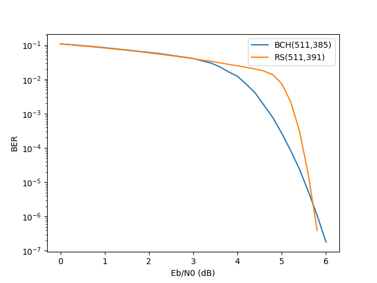
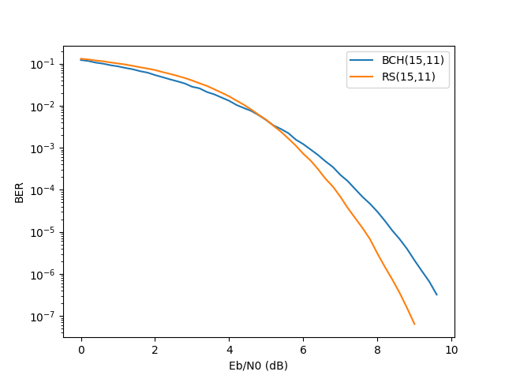
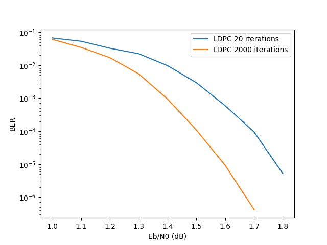
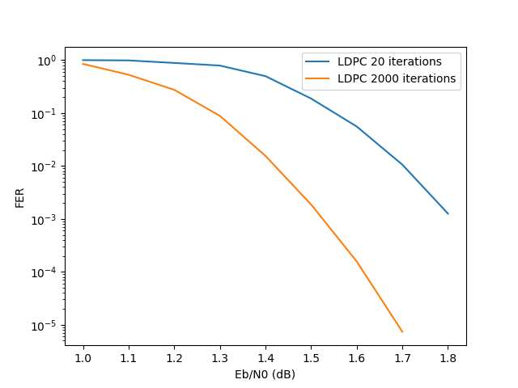
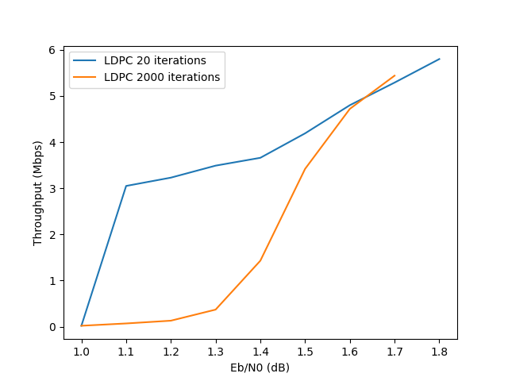

## Channel Coding Simulation Logs for my BSc project

This is the repo to keep the simulation results of my BSc work at Amir Kabir University of Technology, Tehran, Iran

under each directory, some txt files would be found that each contains a specific [AFF3CT](https://github.com/aff3ct/aff3ct) simulation Command and result. there is also a `plot.py` file under each directory, that is used to plot the result numbers. the [numpy](https://numpy.org/) and [matplotlib](https://matplotlib.org/) was used here.

The plotted charts are saved as `PNG` and are shown below.

please feel free to contact me about this project by my email address **shahedi[at]aut.ac.ir**

### BCH vs RS

### LDPC in different iterations

